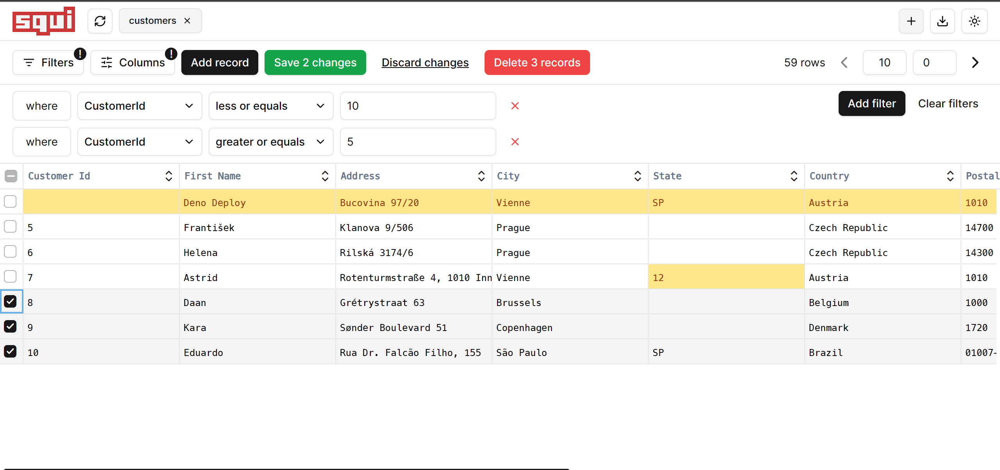

# SQUI - SQL database GUI

SQUI is a SQL database GUI written using .Net Core 7 and Vue3. Currently it supports only SQLite databases, but support for other databases is planned.



The UI is inspired from the [Prisma](https://www.prisma.io/studio) and [Drizzle Kit](https://orm.drizzle.team/drizzle-studio/overview) Studio interfaces, with a focus on simplicity and ease of use.

## Usage

Get the latest release from the [releases page](https://github.com/CatalinIuga/squi/releases) and run the executable. You can then just specify the path to the SQLite database file and start querying.

```bash
squi <database>
```

If you want to build the project yourself, you can do so by running the following command in the root of the project:

```bash
dotnet release -c Release -r <rid>
```

Where `<rid>` is the runtime identifier for the platform you want to build for. You can find a list of supported RIDs [here](https://docs.microsoft.com/en-us/dotnet/core/rid-catalog).

You can also run the project using the following command:

```bash
dotnet run -- <database>
```

## Features

- [x] Connect to SQLite databases
- [x] Browse tables
- [x] Filter data using different conditions/limits/offests
- [x] Add, update and delete rows
- [x] Export data in JSON format

## Roadmap

- [ ] Refactor the codebase
- [ ] Add tests
- [ ] Support for other databases
- [ ] Create/Update/Delete tables
- [ ] Raw SQL queries

## Project structure

The project is composed of 2 parts: the client and the server. The client is a Vue3 frontend that communicates with the server using a REST API. The production build of the client is embedded in the server executable, so you don't need to serve it separately. While this does result in a larger executable, I personally prefer this approach as it makes the usage/installation of the application easier.

- Client - Vue3 frontend
- Connectors - Database connectors (currently only SQLite)
- Controllers - API controllers
  - SpaController - Serves the Vue3 frontend from the embedded resources
  - DatabaseController - Handles database operations
- Models - Database models, specifically the Columns and Table schemas
- wwwroot - Static files from the Vue3 frontend that will be embedded in the executable
- Program.cs - Entry point of the application
